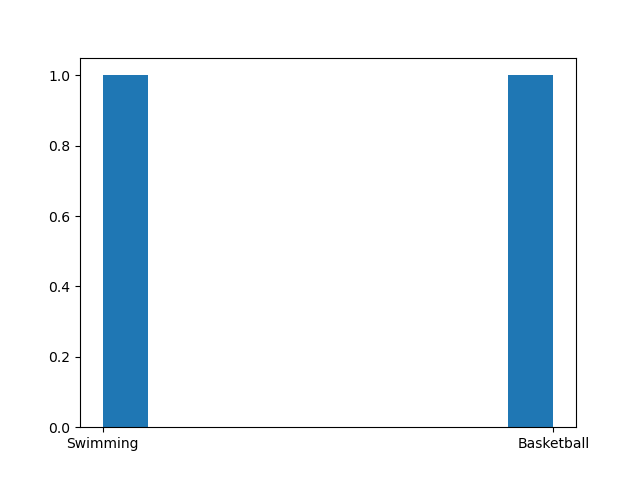

# Multi-agent systems
## Projet 1 : [Preys & Predators](https://docs.google.com/document/d/118d3Ynb-69fR4n2nVzAx7hxlzpl_CJVOSKRZr7UUY0U/edit?usp=sharing)

## Projet 2 : Argumentation-based dialogue for choosing a sport
### Overview
The goal of this simulation is to conduct an argumentation-based dialogue between 10 artificial agents, each representing a different preference for criteria and items related to sports. These agents will interact with each other in a structured dialogue format to make a joint decision regarding the best sport. 

### Agent Preferences
#### Data about sports
The preferences for each agent will be randomly generated using a "get_data" script, which will assign random values to criteria such as popularity, physical_intensity, skill_required, team_play and entertainment_value. The agents will engage in arguments and counterarguments, presenting their preferences and supporting them with arguments based on their preferences. The dialogue will be structured using a predetermined set of rules and guidelines for argumentation. The generated json file contains for agent ratings for each criterion on a scale of 1 to 5, and has also ratinns for each sport for these criteria using values such as "VERY_GOOD", "GOOD", "BAD", or "VERY_BAD". 
#### Get preferences
How an agent sets and compares their preferences regarding different sports and criteria is defined in the Preference class which will be an attribute of an agent object. The method generate_preferences of the ArgumentAgent class enables to generate the preferences object by reading the data file. There are 2 auxiliary functions transform_name and transform_value to switch from strings in the json file to correct criteria names and values.

### Communication
We use 5 message performatives: PROPOSE - ASK_WHY - ARGUE - ACCEPT - COMMIT.
The ArgumentModel class initializes a simulation environment with a number of agents ( 2 in oour study randomly), each with their own set of preferences generated using the Preferences class. The number of agents and maximum number of simulation steps are passed as arguments. A RandomActivation object is created to schedule the agents, and a MessageService object is created to handle message passing between the agents. We have modify the provieded code to initialize a MessageService object at the beginning with a basic scheduler which will help us use this object for each simulation of dialogue.

### Arguments
An argument can consist of a couple-value, for example: "Soccer <= CriterionName.ENTERTAINMENT = Value.VERY_GOOD" or a comparison between two criteria or both.

### Selecting arguments
#### Support
The method List_Supporting_Proposal, takes a sport as a parameter and generates a list of premises that can be used to support the sport. It iterates through the preference criteria of the agent and checks if the criterion is related to the given sport. If the criterion's value is GOOD or VERY_GOOD. The method returns the supporting_proposals list sorted by order of importance based on the agent's preferences.

The method support_proposal, is used when the agent receives an ASK_WHY message after having proposed a sport. It takes the sport as a parameter and put the strongest supportive argument unseen so far for it by calling the List_Supporting_Proposal method.

#### Attack
The method List_Attacking_Proposal, does the same but this time to attack a sport, not support it. But we decided not to use it because a counter-argument depends on the argument of the other agent.

### Relations among arguments
The method attack_argument, decides whether an argument made by another agent can be attacked or not. The method checks multiple conditions to determine if an argument can be attacked or not:
* If the criterion is not important for the current agent, based on their order of importance
* If the value given to the sport is lower than the one of the other agent on the considered criterion
* If the current agent prefers another sport and can defend it by an argument with a better value on the same criterion
* If the three conditions are not filled, the agent check if he can propose another sport not seen so far.

If any of the above conditions is met, the method returns True and a number (1, 2, or 3) that indicates the reason for the attack. Otherwise, it returns False and 0.

### Simulation
A random pair (A, B) of agents are chosen from the agent schedule. A sends a message with the PROPOSE performative and its most preferred sport to B. The simulation then runs until the max_steps limit is reached or the simulation is stopped.

#### How a discussion goes
The step method of the ArgumentAgent class defines the implemented discussion rules each agent follows. It checks if there are new messages for the agent, and if so, processes them according to the performative of the message:
* Send a PROPOSE with its most preferred sport or a random sport if it already proposed it
* Willingly send an ACCEPT if the sport is the most preferred - or among the 10% most preferred sports
* Send an ASK_WHY instead of accepting to make the other provide an argument
* Send an ARGUE to provide an argument replying to an ASK_WHY or to a previous ARGUE
* An argument with a couple-value replies to an ASK_WHY
* An argument with both a couple-value and a comparison replies to a previous ARGUE
* When receiving a previous ARGUE argument, processes it and checks if it can accept it or if it needs to counter-argue
* If it accepts the argument, it sends an ACCEPT
* If it needs to counter-argue, it creates a counter-argument object and sends an ARGUE
* If the attack level is 3, it sends a PROPOSE
* Unwillingly send an ACCEPT if there is no other choice
* Send a COMMIT if it receives an ACCEPT
* Send a COMMIT if it receives a COMMIT

We make sure the model's running attribute is set to False to indicate that the simulation is over after a common agreement is reached.

#### Launch
We made sure the simulation prints out every message that is exchanged during the discussion.
Run the pw_sport.py file, sit back and watch the agents discuss! It will simulate 100 discussions between two agents chosen randomly in the set of agents.

## Results
Our 2-agent argumentation-based dialogue system is fully functional. We tested it with 2 different item types:
* Car engines (2) - Default
* Sports (10) - Own

### Statistics about our simulations
For the simulation based on sports, we've got this histogram of the sports chosen on each of the 100 simulations.

## Next steps
We need to decide on the agreement-making process between the agents, as in this first approach, the chosen item is the last one that cannot be attacked by a counter-argument. We have thought of another decision process where the chosen item will be the one with the minimum score, with the score being the difference between the number of arguments in favor and those against. Lastly, we could weigh the arguments to determine which type of argument is stronger.
